# ZJU-blockchain-course-2025

## 项目简介

这是一个功能完整的去中心化彩票系统，支持竞猜项目创建、彩票购买、二级市场交易和自动奖金分发。系统采用现代化的Web3技术栈构建，为用户提供安全、透明、去中心化的彩票游戏体验。

## 如何运行

1. 在本地启动ganache应用。

2. 在 `./contracts` 中安装需要的依赖，运行如下的命令：
    ```bash
    npm install
    ```
3. 在 `./contracts` 中编译合约，运行如下的命令：
    ```bash
    npx hardhat compile
    ```
4. 在 `./contracts` 中部署合约到ganache，运行如下的命令：
    ```bash
    npx hardhat run scripts/deploy.ts --network ganache
    ```
5. 在 `./frontend` 中安装需要的依赖，运行如下的命令：
    ```bash
    npm install
    ```
6. 修改 `./frontend/src/contracts/config.ts` 中的内容，将合约地址分别修改为第四步中显示的合约地址
7. 在 `./frontend` 中启动前端程序，运行如下的命令：
    ```bash
    npm start
    ```

## 功能实现分析

### 1. 用户角色系统

将参与方划分为竞猜玩家和公证人，在前端分别展示不同的界面，提供不同的服务。

#### 竞猜玩家功能

- **领取测试积分**：一键领取一次性的空投积分用于测试
- **购买彩票**：使用LT积分购买指定项目的彩票
- **二级市场交易**：出售或购买持有的彩票
- **查看用户资料**：查看持有彩票、当前余额和中奖记录等

#### 公证人功能

- **项目管理**: 创建竞猜项目，设置奖池和截止时间
- **结果公布**: 选择获胜选项，触发自动奖金分发
- **代币铸造**: 为用户或自己铸造LT积分代币

### 2. 核心技术实现

#### NFT彩票系统

采用**ERC721**实现彩票凭证，每张彩票都是独一无二的NFT，包含项目ID、选项ID、投注金额等信息。

#### 积分代币系统

使用**ERC20**实现LT积分代币，作为系统内的统一价值单位。支持标准的转账、授权等功能，并集成铸造功能供公证人管理代币供应量。

#### 链上订单簿系统

通过智能合约实现完全去中心化的订单簿，支持彩票的上架、购买、撤销等操作。前端按选项和价格进行排序展示，确保交易的透明性。

#### 自动奖金分发机制

项目结束时，智能合约自动扫描所有彩票，识别获胜彩票，按照投注比例计算奖金并直接转账LT代币给获胜者。

#### 权限管理系统

基于**OpenZeppelin的Ownable模式**实现公证人权限控制，确保只有授权的公证人可以创建项目、结算奖金和铸造代币。

## 项目运行截图

### 1. 主页界面
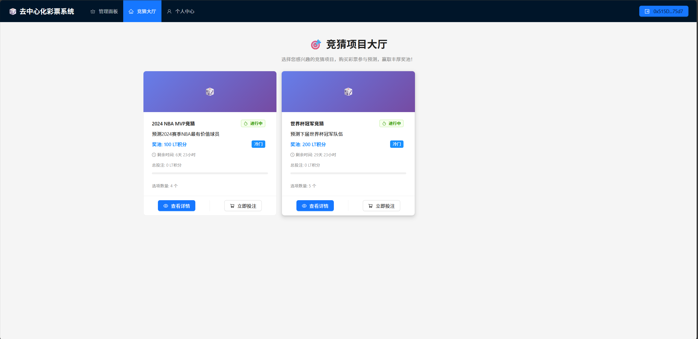
*展示所有进行中的竞猜项目，用户可以浏览和参与*

### 2. 项目详情页
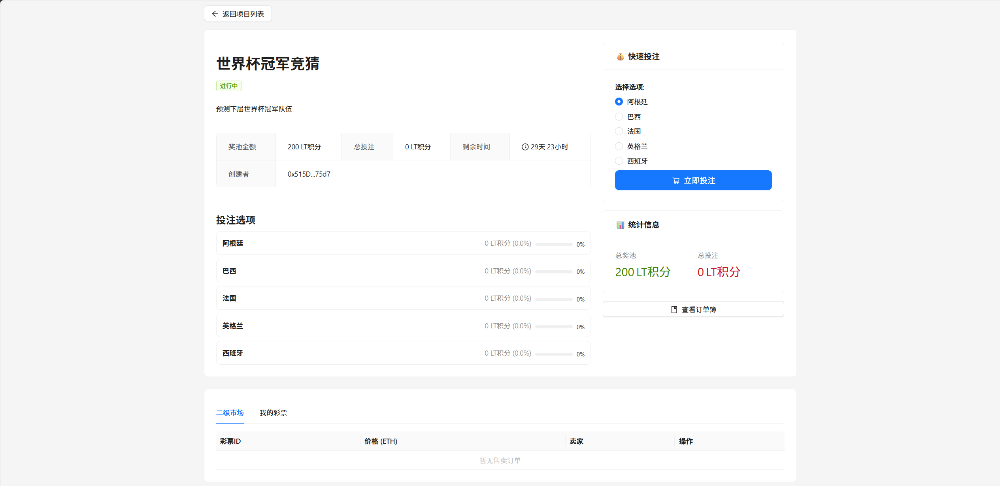
*显示项目详细信息、投注选项、二级市场等*

### 3. 公证人管理面板
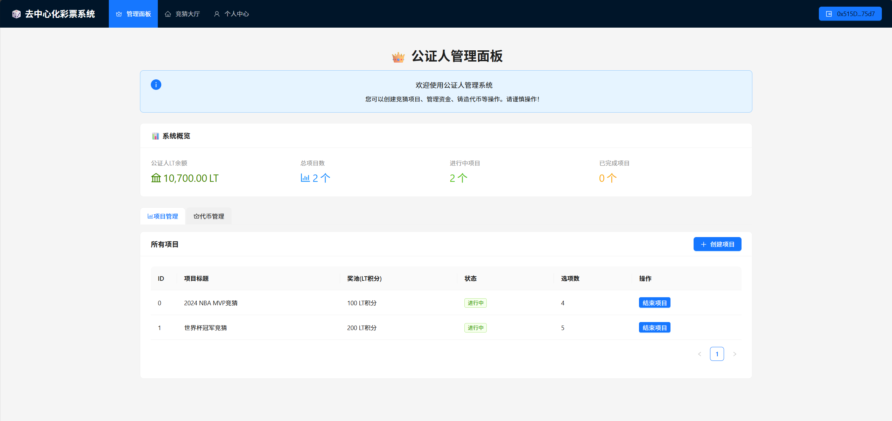
*公证人专用管理界面，包含项目管理、代币铸造等功能*

### 4. 个人中心
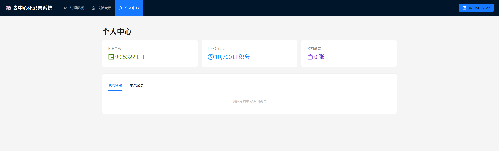
*查看用户信息，包含持有彩票、中奖记录和余额信息*

### 5. 二级市场订单簿
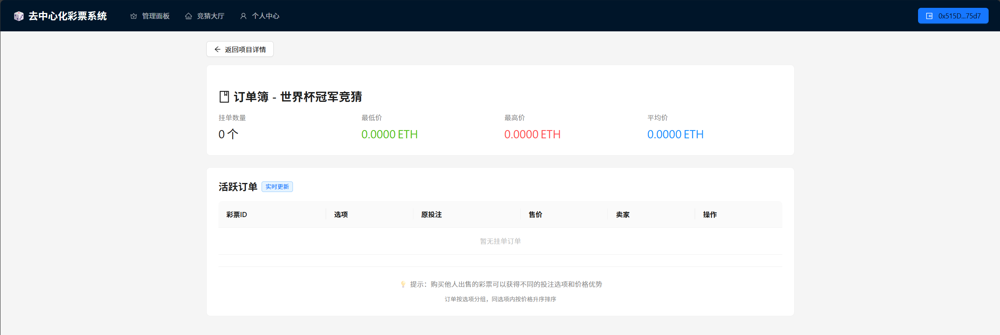
*按选项和价格排序的订单列表*

### 6. MetaMask交互与彩票购买
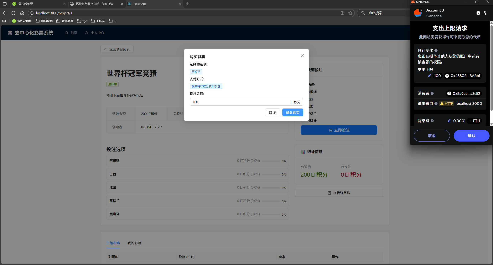
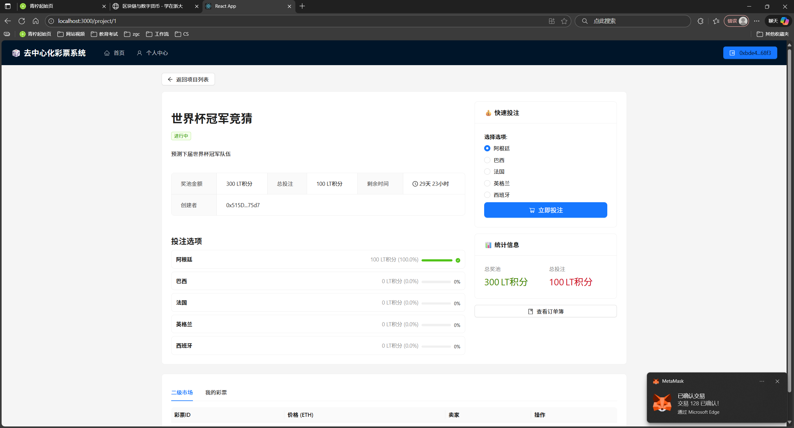

### 7. 创建项目
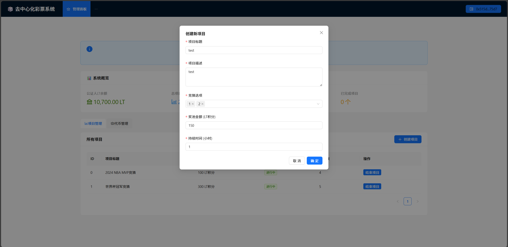
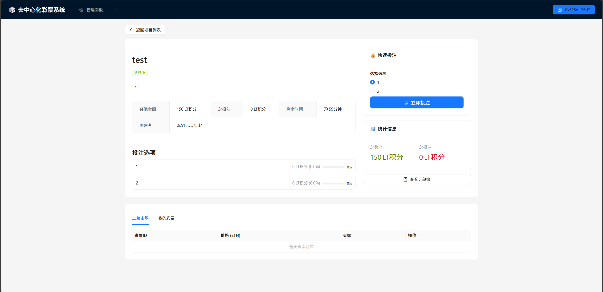

### 8. 结束项目
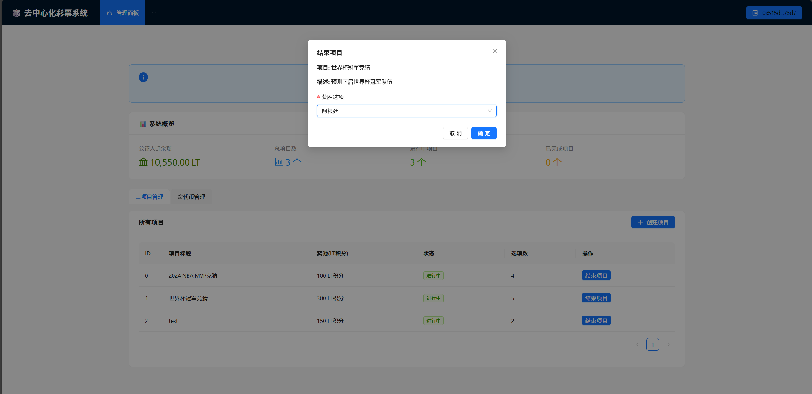
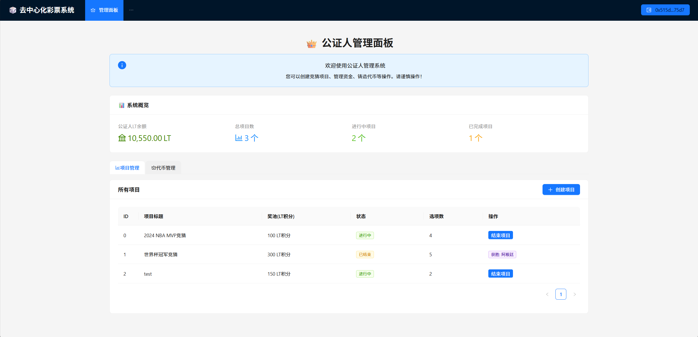
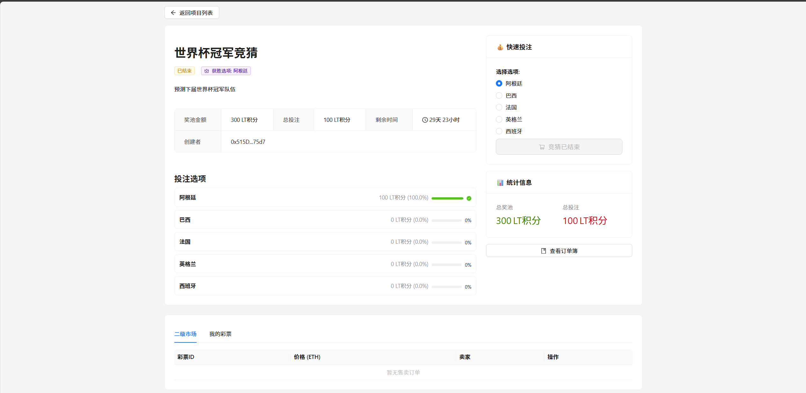
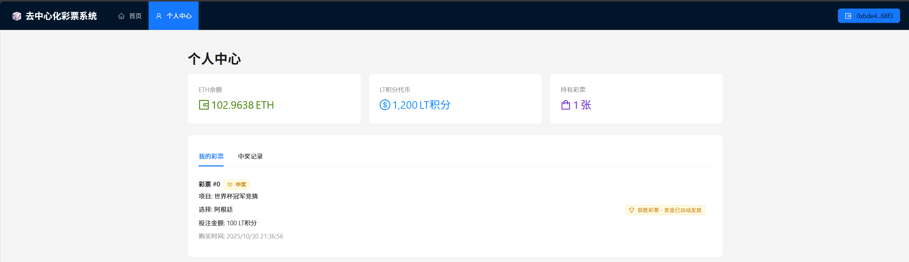

## 参考内容

- 课程的参考Demo见：[DEMOs](https://github.com/LBruyne/blockchain-course-demos)。

- 快速实现 ERC721 和 ERC20：[模版](https://wizard.openzeppelin.com/#erc20)。记得安装相关依赖 ``"@openzeppelin/contracts": "^5.0.0"``。

- 如何实现ETH和ERC20的兑换？ [参考讲解](https://www.wtf.academy/en/docs/solidity-103/DEX/)
